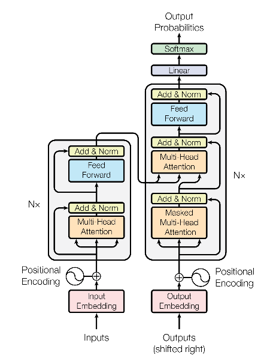
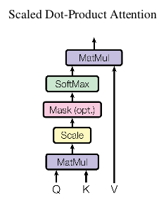
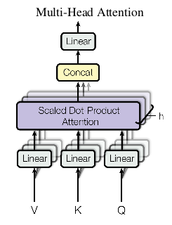

# Attention Is All You Need (Transformer)

Transformer was originally proposed for the task of machine translation in NIPS-2017 paper "Attention Is All You Need".

Here, I have implemented the Transformer network for text classification. Some part of the code is based on the [blog post](http://nlp.seas.harvard.edu/2018/04/03/attention.html) by Alexander Rush on Transformer. We have made some modificaitons to make the Transformer work for text classification problem, details of which are given in section "Using Transformer for Classification".

## Transformer Motivation
- Despite GRUs and LSTMs, RNNs still need attention mechanism to deal with long range dependencies. This is because path length for co-dependent computation between stages grow with sequence
- Why not use *just* the attention without the RNNs

## Transformer Overview
- Sequence-to-sequence model
- Encoder-decoder architecture
- Machine translation with parallel corpus
- Predict each translated word
- Final cost function is standard Cross Entropy error on top of a softmax classifier

## Basic Building Block - Dot Product Attention

**Inputs: **

- A query *q*
- Set of key-value (*k-v*) pairs to an output
- Query, keys, values and output are all vectors
- Output is weighted sum of values
- Weight of each value is computed using an inner product of query and corresponding key
- Query and keys have dimensionality dk
- Values have dimensionality dv

### Dot-Product Attention - Matrix Notation
- When we have multiple queries *q*, we stack them in a matrix *Q*.

### Scaled Dot-Product Attention
**Problem:** As dk gets large, the variance of qTk increase 
-> some values inside the softmax get large 
-> the softmax gets very peaked 
-> hence its gradient gets smaller

**Solution:** Scale by length of query/key vectors.

## Self-Attention and Multi-head Attention
- Input word vectors could be the queries, keys and values
- The word vectors themselves select each other
- Word vector stacks - Q = K = V
- **Problem:** Only one way for words to interact with each other
- **Solution:** Multi-head attention
- First map Q,K,V into *h* many lower dimensional spaces via **W** matrices
- Then apply attention, then concatenate outputs and pipe through linear layer

where

- 

**Implementation details:**
- *h* = 8
- dmodel = 512
- dk = dv = dmodel / h = 64

## Encoder Input
- Sentences are encoded using byte-pair encodings
- For the model to make use of the order of the sequence, positional encoding is used

## Complete Encoder
- Encoder is composed of *N*=6 identical layers
- Each layer has 2 sub-layers
(1) Multi-head attention
(2) 2-layer feed-forward network
- Each sublayer also has
(1) Residual (short-circuit)
(2) Layer normalization
- i.e. output of each sublayer is **LayerNorm(*x*+Sublayer(x))**
- In a self-attention layer, all the **keys**, **values** and **queries** come from the same place - the output of previous layer in the encoder.
- Each position in the encoder can attend to all positions in the previous layer of the encoder

## Complete Decoder
- Similar to encoder, decoder is also composed of *N*=6 identical layers
- Each layer of decoder has 3 sub-layers
(1) Maksed multi-head attention over previous decoder outputs
(2) Multi-head attention over output of encoder
(3) 2-layer feed-forward network
- Each sublayer also has
(1) Residual (short-circuit)
(2) Layer normalization
- i.e. output of each sublayer is **LayerNorm(*x*+Sublayer(x))**
- In encoder-decoder attention, **queries** come from previous decoder layer, **keys** and **values** come from output of encoder 
- This allows every position in the decoder to attend over all positions in the input sequence
- Self-attention in the decoder allow each position in decoder to attend to all positions in the decoder *up to and including that position*.
- We need to prevent leftward information flow in the decoder to preserve the auto-regressive property

## Label Smoothing
- Label smoothing is a regularization technique introduced in ["Rethinking the Inception Architecture for Computer Vision"](https://arxiv.org/abs/1512.00567)
- For classification problems with one correct class, loss functions such as *cross entropy* attain optima by maximizing the log likelihood of the correct class. This may lead to overfitting if the model learns to assign full probability to ground truth label for training examples.
- Label smoothing encourages the model to become less confident about its predictions.
- For a training example with ground-truth label *y*, it replaces the (true) label distribution  with 

where *u(k)* is a distribution over the labels independent of the training example *x*, such as the "uniform distribution"; and  is a smoothing parameter.

- Then, minimizing the cross-entropy loss is equivalent to minimizing the KL-divergence between label distribution and predicted distribution. This is because

## Using Transformer for Classification
- Only encoder part of Transformer model is used for classification
- No residual connection, no layer normalization
- No need for masking
- Multihead attention and positionwise feedforward network to extract features
- Then, linear layer to get logits

## Implementation Details
- N = 1, i.e. one layer is used
- d_model = 256
- maximum sequence lenght = 60
- Adam optimizer is used with initial learning rate 0.0003. Reducing by half every 1/3 epochs.

## References:
1) [Attention Is All You Need](https://arxiv.org/abs/1706.03762)
2) [http://nlp.seas.harvard.edu/2018/04/03/attention.html](http://nlp.seas.harvard.edu/2018/04/03/attention.html)
3) [http://web.stanford.edu/class/cs224n/lectures/lecture12.pdf](http://web.stanford.edu/class/cs224n/lectures/lecture12.pdf)
4) [Rethinking the Inception Architecture for Computer Vision](https://arxiv.org/pdf/1705.03122.pdf) (for positional encoding)
